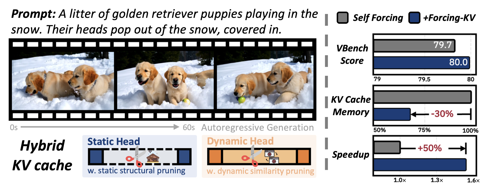
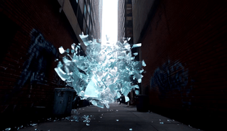
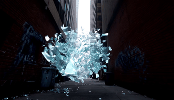
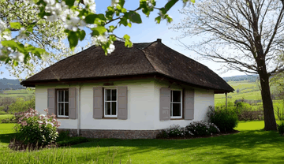
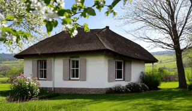

<div align="center">

<h1>Forcing-KV: Hybrid KV Cache Compression for Efficient Autoregressive Video Diffusion Models</h1>


<p>
<strong>Yicheng Ji</strong><sup>1,2</sup>&emsp;
<strong>Zhizhou Zhong</strong><sup>2,3</sup>&emsp;
<strong>Jun Zhang</strong><sup>1</sup>&emsp;
<strong>Qin Yang</strong><sup>2</sup>&emsp;
<strong>Xitai Jin</strong><sup>2</sup><br>
<strong>Ying Qin</strong><sup>4</sup>&emsp;
<strong>Wenhan Luo</strong><sup>3</sup>&emsp;
<strong>Shuiyang Mao</strong><sup>2</sup>&emsp;
<strong>Wei Liu</strong><sup>2</sup>&emsp;
<strong>Huan Li</strong><sup>1</sup>
</p>

<p>
<sup>1</sup><strong>ZJU</strong>&emsp;
<sup>2</sup><strong>Video Rebirth</strong>&emsp;
<sup>3</sup><strong>HKUST</strong>&emsp;
<sup>4</sup><strong>BJTU</strong>
</p>


[](https://arxiv.org/abs/2605.09681)
[](https://zju-jiyicheng.github.io/Forcing-KV-Page/)
[](https://github.com/zju-jiyicheng/Forcing-KV)


</div>


## ✨ Highlights

1. **KV Compression Method**: [Forcing-KV](https://github.com/zju-jiyicheng/Forcing-KV) is a hybrid KV cache compression method for autoregressive video diffusion models that accelerates inference, reduces cache memory,  and even improves quality.
2. **Inference Toolkit**:This repository is an inference-side toolkit providing inference scripts for multiple models ([Self-Forcing](https://github.com/guandeh17/Self-Forcing), [LongLive](https://github.com/NVlabs/LongLive), [Krea-realtime-14B](https://github.com/krea-ai/realtime-video), [Rolling-Forcing](https://github.com/TencentARC/RollingForcing)) and various acceleration techniques ([Forcing-KV](https://github.com/zju-jiyicheng/Forcing-KV), [Dummy Forcing](https://github.com/csguoh/DummyForcing), [TeaCache](https://github.com/ali-vilab/TeaCache), [FP8 Quantization](https://github.com/thu-ml/SageAttention)), facilitating research and comparative studies.
3. **Easy Evaluation**:We also provide evaluation scripts for conveniently assessing [VBench](https://github.com/Vchitect/VBench), [VBench-Long](https://github.com/Vchitect/VBench/tree/master/vbench2_beta_long), [Helios-Bench](https://github.com/PKU-YuanGroup/Helios), and the [Chunk Discontinuity Metric](evaluation/Raft/README.md).


<div align="center">



</div>


> Over 29 FPS with 30% cache memory reduction, up to 1.35× and 1.50× speedups on LongLive and Self Forcing at 480P resolution, and 2.82× at 1080P resolution.
<br>


## 📣 Latest News!!

- **2026-05-10:** We open source the inference code. We support the inference of [Self-Forcing](https://github.com/guandeh17/Self-Forcing), [LongLive](https://github.com/NVlabs/LongLive), [Krea-realtime-14B](https://github.com/krea-ai/realtime-video), [Rolling-Forcing](https://github.com/TencentARC/RollingForcing).
- **2026-05-10:** We support various acceleration techniques including [Forcing-KV](https://github.com/zju-jiyicheng/Forcing-KV), [Dummy Forcing](https://github.com/csguoh/DummyForcing), [TeaCache](https://github.com/ali-vilab/TeaCache), and [FP8 Quantization](https://github.com/thu-ml/SageAttention).
- **2026-05-10:** We provide easy evaluation sripts for conveniently assessing [VBench](https://github.com/Vchitect/VBench), [VBench-Long](https://github.com/Vchitect/VBench/tree/master/vbench2_beta_long), [Helios-Bench](https://github.com/PKU-YuanGroup/Helios), and the [Chunk Discontinuity Metric](evaluation/Raft/README.md) we purpose.
- **2026-05-10:** ArXiv paper available [here](https://arxiv.org/abs/2605.09681)!


## 🎬 Video Demos

### LongLive

<details open>
<summary><b>Click to Open</b></summary>
<table>
<tr>
<td align="center" width="50%"><b>LongLive</b></td>
<td align="center" width="50%"><b>Forcing-KV</b></td>
</tr>
<tr>
<td align="center" width="50%">
<a href="assets/videos/longlive_30s/case_02_baseline.mp4"></a>
</td>
<td align="center" width="50%">
<a href="assets/videos/longlive_30s/case_02_forcingkv.mp4"></a>
</td>
</tr>
<tr>
<td align="center" width="50%">
<a href="assets/videos/longlive_30s/case_11_baseline.mp4"></a>
</td>
<td align="center" width="50%">
<a href="assets/videos/longlive_30s/case_11_forcingkv.mp4"></a>
</td>
</tr>
<tr>
<td align="center" width="50%">
<a href="assets/videos/longlive_5s/case_03_baseline.mp4"></a>
</td>
<td align="center" width="50%">
<a href="assets/videos/longlive_5s/case_03_forcingkv.mp4"></a>
</td>
</tr>
</table>
</details>

### Krea-realtime-14B

<details open>
<summary><b>Click to Open</b></summary>
<table>
<tr>
<td align="center" width="50%"><b>Krea-realtime-14B</b></td>
<td align="center" width="50%"><b>Forcing-KV</b></td>
</tr>
<tr>
<td align="center" width="50%">
<a href="assets/videos/krea_5s/case_01_baseline.mp4"></a>
</td>
<td align="center" width="50%">
<a href="assets/videos/krea_5s/case_01_forcingkv.mp4"></a>
</td>
</tr>
<tr>
<td align="center" width="50%">
<a href="assets/videos/krea_5s/case_02_baseline.mp4"></a>
</td>
<td align="center" width="50%">
<a href="assets/videos/krea_5s/case_02_forcingkv.mp4"></a>
</td>
</tr>
<tr>
<td align="center" width="50%">
<a href="assets/videos/krea_5s/case_03_baseline.mp4"></a>
</td>
<td align="center" width="50%">
<a href="assets/videos/krea_5s/case_03_forcingkv.mp4"></a>
</td>
</tr>
</table>
</details>

### Self Forcing

<details open>
<summary><b>Click to Open</b></summary>
<table>
<tr>
<td align="center" width="50%"><b>Self Forcing</b></td>
<td align="center" width="50%"><b>Forcing-KV</b></td>
</tr>
<tr>
<td align="center" width="50%">
<a href="assets/videos/self_forcing_5s/case_01_baseline.mp4"></a>
</td>
<td align="center" width="50%">
<a href="assets/videos/self_forcing_5s/case_01_forcingkv.mp4"></a>
</td>
</tr>
<tr>
<td align="center" width="50%">
<a href="assets/videos/self_forcing_5s/case_02_baseline.mp4"></a>
</td>
<td align="center" width="50%">
<a href="assets/videos/self_forcing_5s/case_02_forcingkv.mp4"></a>
</td>
</tr>
<tr>
<td align="center" width="50%">
<a href="assets/videos/self_forcing_5s/case_03_baseline.mp4"></a>
</td>
<td align="center" width="50%">
<a href="assets/videos/self_forcing_5s/case_03_forcingkv.mp4"></a>
</td>
</tr>
</table>
</details>

Click any preview to view the full MP4. All demo files are available under [here](assets/videos). More at our [demo page](https://zju-jiyicheng.github.io/Forcing-KV-Page).


## Method
<p align="center">
    
</p>

> We apply static structural pruning and dynamic similarity pruning to different heads, accelerating inference, reducing cache memory while improving quality.


## ⚙️ Requirements and Installation

### Installation

```
# Create Environment
git clone https://github.com/zju-jiyicheng/Forcing-KV
cd Forcing-KV
conda create -n forcingkv python=3.10 -y
conda activate forcingkv

# Install Dependencies
pip install torch torchvision torchaudio
pip install -r requirements.txt
pip install flash-attn --no-build-isolation

# Optional: FP8 quantization
git clone https://github.com/thu-ml/SageAttention.git
cd SageAttention 
python setup.py install
```

### Downloading Base Models
Downloading the base models ckpt to `pretrained`:
```
# Wan
hf download Wan-AI/Wan2.1-T2V-1.3B --local-dir pretrained/Wan2.1-T2V-1.3B

# Longlive 
hf download Efficient-Large-Model/LongLive-1.3B --local-dir pretrained/Longlive-1.3B 

# Self Forcing
hf download gdhe17/Self-Forcing --local-dir pretrained/Self-Forcing

# Krea-realtime-14b
hf download krea/krea-realtime-video krea-realtime-video-14b.safetensors --local-dir pretrained/realtime   

# Rolling Forcing
hf download TencentARC/RollingForcing --local-dir pretrained/Rolling-Forcing
```
Also modify the absolute path in `utils/wan_wrapper.py` and the .yaml files under `configs/`.


## 🚀 Quick Inference

### Inference Scripts
```
# Forcing-KV
python inference.py --config_path configs/forcing-kv/forcingkv_longlive_inference.yaml
python inference.py --config_path configs/forcing-kv/forcingkv_realtime_inference.yaml
python inference.py --config_path configs/forcing-kv/forcingkv_self_forcing_inference.yaml
python inference.py --config_path configs/forcing-kv/forcingkv_longlive_interactive_inference.yaml ## Interacrive prompts

# Base model
python inference.py --config_path configs/longlive/longlive_inference.yaml
python inference.py --config_path configs/self-forcing/self_forcing_inference.yaml
python inference.py --config_path configs/krea-14b/realtime_inference.yaml
python inference.py --config_path configs/longlive/longlive_interactive_inference.yaml ## Interacrive prompts

# Dummy Forcing
python inference.py --config_path configs/dummy-forcing/dummy_longlive_inference.yaml
python inference.py --config_path configs/dummy-forcing/dummy_self_forcing_inference.yaml

```

### Args
- **Generation Length**: Set the `num_output_frames` parameter in the config file to control generated length.
- **Resolution**: Set the `resolution` parameter to generate videos at the target resolution (480P, 720P, 1080P).
- **Custom Prompts**: Set the `data_path` parameter to the prompt file you want to use.
- **Quantization**: Set the `quantization_enabled` parameter to enable or disable quantization.


## 🚀 Evaluation
- **VBench / VBench-Long**: see the documents [here](evaluation/VBench/readme.md).
- **Helios Bench**: see the documents [here](evaluation/Helios/README.md).
- **Chunk Discontinuity Metirc**: see the documents [here](evaluation/Raft/README.md).


## <a name="cite"></a> Citation

If you find our work useful in your research, please consider to cite our paper and this framework📝:

```
@misc{ji2026forcingkvhybridkvcache,
      title={{Forcing-KV: Hybrid KV Cache Compression for Efficient Autoregressive Video Diffusion Models}}, 
      author={Yicheng Ji and Zhizhou Zhong and Jun Zhang and Qin Yang and XiTai Jin and Ying Qin and Wenhan Luo and Shuiyang Mao and Wei Liu and Huan Li},
      year={2026},
      eprint={2605.09681},
      archivePrefix={arXiv},
      primaryClass={cs.CV},
      url={https://arxiv.org/abs/2605.09681}, 
}
```

## Acknowledgement

Our repository is built on [Self-Forcing](https://github.com/guandeh17/Self-Forcing), [LongLive](https://github.com/NVlabs/LongLive), [Dummy Forcing](https://github.com/csguoh/DummyForcing), and [Helios](https://github.com/PKU-YuanGroup/Helios). Thanks for their wonderful work.
