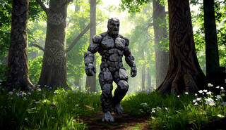
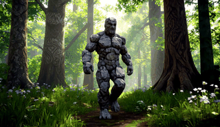
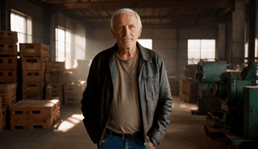
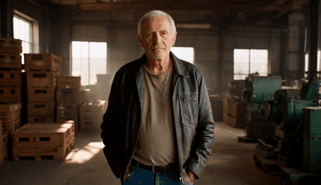
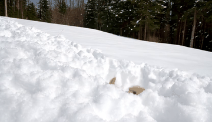
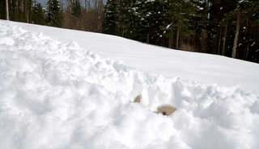

<div align="center">

<h1>Forcing-KV: Hybrid KV Cache Compression for Efficient Autoregressive Video Diffusion Models</h1>


<p>
<strong>Yicheng Ji</strong><sup>1,2</sup>&emsp;
<strong>Zhizhou Zhong</strong><sup>2,3</sup>&emsp;
<strong>Jun Zhang</strong><sup>1</sup>&emsp;
<strong>Qin Yang</strong><sup>2</sup>&emsp;
<strong>Xitai Jin</strong><sup>2</sup><br>
<strong>Ying Qin</strong><sup>4</sup>&emsp;
<strong>Wenhan Luo</strong><sup>3</sup>&emsp;
<strong>Shuiyang Mao</strong><sup>2</sup>&emsp;
<strong>Wei Liu</strong><sup>2</sup>&emsp;
<strong>Huan Li</strong><sup>1</sup>
</p>

<p>
<sup>1</sup><strong>ZJU</strong>&emsp;
<sup>2</sup><strong>Video Rebirth</strong>&emsp;
<sup>3</sup><strong>HKUST</strong>&emsp;
<sup>4</sup><strong>BJTU</strong>
</p>


[](https://zju-jiyicheng.github.io/Forcing-KV-Page/)
[](https://zju-jiyicheng.github.io/Forcing-KV-Page/)


</div>


## ✨ Highlights

1. **KV Compression Method**: [Forcing-KV](https://github.com/zju-jiyicheng/Forcing-KV) is a hybrid KV cache compression method for autoregressive video diffusion models that accelerates inference, reduces cache memory,  and even improves quality.
2. **Inference Toolkit**:This repository is an inference-side toolkit providing inference scripts for multiple models ([Self-Forcing](https://github.com/guandeh17/Self-Forcing), [LongLive](https://github.com/NVlabs/LongLive), [Krea-realtime-14B](https://github.com/krea-ai/realtime-video), [Rolling-Forcing](https://github.com/TencentARC/RollingForcing)) and various acceleration techniques ([Forcing-KV](https://github.com/zju-jiyicheng/Forcing-KV), [Dummy Forcing](https://github.com/csguoh/DummyForcing), [TeaCache](https://github.com/ali-vilab/TeaCache), [FP8 Quantization](https://github.com/thu-ml/SageAttention)), facilitating research and comparative studies.
3. **Easy Evaluation**:We also provide evaluation scripts for conveniently assessing [VBench](https://github.com/Vchitect/VBench), [VBench-Long](https://github.com/Vchitect/VBench/tree/master/vbench2_beta_long), [Helios-Bench](https://github.com/PKU-YuanGroup/Helios), and the [Chunk Discontinuity Metric](evaluation/Raft/README.md).


<div align="center">


</div>


> Over 29 FPS with 30% cache memory reduction, up to 1.35× and 1.50× speedups on LongLive and Self Forcing at 480P resolution, and 2.82× at 1080P resolution.
<br>


## 📣 Latest News!!

- **2026-05-10:** We open source the inference code. We support the inference of [Self-Forcing](https://github.com/guandeh17/Self-Forcing), [LongLive](https://github.com/NVlabs/LongLive), [Krea-realtime-14B](https://github.com/krea-ai/realtime-video), [Rolling-Forcing](https://github.com/TencentARC/RollingForcing).
- **2026-05-10:** We support various acceleration techniques including [Forcing-KV](https://github.com/zju-jiyicheng/Forcing-KV), [Dummy Forcing](https://github.com/csguoh/DummyForcing), [TeaCache](https://github.com/ali-vilab/TeaCache), and [FP8 Quantization](https://github.com/thu-ml/SageAttention).
- **2026-05-10:** We provide easy evaluation sripts for conveniently assessing [VBench](https://github.com/Vchitect/VBench), [VBench-Long](https://github.com/Vchitect/VBench/tree/master/vbench2_beta_long), [Helios-Bench](https://github.com/PKU-YuanGroup/Helios), and the [Chunk Discontinuity Metric](evaluation/Raft/README.md) we purpose.


## 🎬 Video Demos

### LongLive

<details open>
<summary><b>Click to Open</b></summary>
<table>
<tr>
<td align="center" width="50%"><b>LongLive</b></td>
<td align="center" width="50%"><b>Forcing-KV</b></td>
</tr>
<tr>
<td align="center" width="50%">
<a href="assets/videos/longlive_30s/case_02_baseline.mp4"></a>
</td>
<td align="center" width="50%">
<a href="assets/videos/longlive_30s/case_02_forcingkv.mp4"></a>
</td>
</tr>
<tr>
<td align="center" width="50%">
<a href="assets/videos/longlive_30s/case_03_baseline.mp4"></a>
</td>
<td align="center" width="50%">
<a href="assets/videos/longlive_30s/case_03_forcingkv.mp4"></a>
</td>
</tr>
<tr>
<td align="center" width="50%">
<a href="assets/videos/longlive_30s/case_08_baseline.mp4"></a>
</td>
<td align="center" width="50%">
<a href="assets/videos/longlive_30s/case_08_forcingkv.mp4"></a>
</td>
</tr>
<tr>
<td align="center" width="50%">
<a href="assets/videos/longlive_30s/case_11_baseline.mp4"></a>
</td>
<td align="center" width="50%">
<a href="assets/videos/longlive_30s/case_11_forcingkv.mp4"></a>
</td>
</tr>
<tr>
<td align="center" width="50%">
<a href="assets/videos/longlive_30s/case_05_baseline.mp4"></a>
</td>
<td align="center" width="50%">
<a href="assets/videos/longlive_30s/case_05_forcingkv.mp4"></a>
</td>
</tr>
<tr>
<td align="center" width="50%">
<a href="assets/videos/longlive_5s/case_01_baseline.mp4"></a>
</td>
<td align="center" width="50%">
<a href="assets/videos/longlive_5s/case_01_forcingkv.mp4"></a>
</td>
</tr>
<tr>
<td align="center" width="50%">
<a href="assets/videos/longlive_5s/case_02_baseline.mp4"></a>
</td>
<td align="center" width="50%">
<a href="assets/videos/longlive_5s/case_02_forcingkv.mp4"></a>
</td>
</tr>
<tr>
<td align="center" width="50%">
<a href="assets/videos/longlive_5s/case_03_baseline.mp4"></a>
</td>
<td align="center" width="50%">
<a href="assets/videos/longlive_5s/case_03_forcingkv.mp4"></a>
</td>
</tr>
<tr>
<td align="center" width="50%">
<a href="assets/videos/longlive_5s/case_05_baseline.mp4"></a>
</td>
<td align="center" width="50%">
<a href="assets/videos/longlive_5s/case_05_forcingkv.mp4"></a>
</td>
</tr>
<tr>
<td align="center" width="50%">
<a href="assets/videos/longlive_5s/case_06_baseline.mp4"></a>
</td>
<td align="center" width="50%">
<a href="assets/videos/longlive_5s/case_06_forcingkv.mp4"></a>
</td>
</tr>
<tr>
<td align="center" width="50%">
<a href="assets/videos/longlive_interactive_60s/case_01_baseline.mp4"></a>
</td>
<td align="center" width="50%">
<a href="assets/videos/longlive_interactive_60s/case_01_forcingkv.mp4"></a>
</td>
</tr>
<tr>
<td align="center" width="50%">
<a href="assets/videos/longlive_interactive_60s/case_02_baseline.mp4"></a>
</td>
<td align="center" width="50%">
<a href="assets/videos/longlive_interactive_60s/case_02_forcingkv.mp4"></a>
</td>
</tr>
</table>
</details>

### Krea-realtime-14B

<details open>
<summary><b>Click to Open</b></summary>
<table>
<tr>
<td align="center" width="50%"><b>Krea-realtime-14B</b></td>
<td align="center" width="50%"><b>Forcing-KV</b></td>
</tr>
<tr>
<td align="center" width="50%">
<a href="assets/videos/krea_5s/case_01_baseline.mp4"></a>
</td>
<td align="center" width="50%">
<a href="assets/videos/krea_5s/case_01_forcingkv.mp4"></a>
</td>
</tr>
<tr>
<td align="center" width="50%">
<a href="assets/videos/krea_5s/case_02_baseline.mp4"></a>
</td>
<td align="center" width="50%">
<a href="assets/videos/krea_5s/case_02_forcingkv.mp4"></a>
</td>
</tr>
<tr>
<td align="center" width="50%">
<a href="assets/videos/krea_5s/case_03_baseline.mp4"></a>
</td>
<td align="center" width="50%">
<a href="assets/videos/krea_5s/case_03_forcingkv.mp4"></a>
</td>
</tr>
</table>
</details>

### Self Forcing

<details open>
<summary><b>Click to Open</b></summary>
<table>
<tr>
<td align="center" width="50%"><b>Self Forcing</b></td>
<td align="center" width="50%"><b>Forcing-KV</b></td>
</tr>
<tr>
<td align="center" width="50%">
<a href="assets/videos/self_forcing_30s_refine/case_02_baseline.mp4"></a>
</td>
<td align="center" width="50%">
<a href="assets/videos/self_forcing_30s_refine/case_02_forcingkv.mp4"></a>
</td>
</tr>
<tr>
<td align="center" width="50%">
<a href="assets/videos/self_forcing_30s_refine/case_05_baseline.mp4"></a>
</td>
<td align="center" width="50%">
<a href="assets/videos/self_forcing_30s_refine/case_05_forcingkv.mp4"></a>
</td>
</tr>
<tr>
<td align="center" width="50%">
<a href="assets/videos/self_forcing_30s_refine/case_06_baseline.mp4"></a>
</td>
<td align="center" width="50%">
<a href="assets/videos/self_forcing_30s_refine/case_06_forcingkv.mp4"></a>
</td>
</tr>
<tr>
<td align="center" width="50%">
<a href="assets/videos/self_forcing_5s/case_01_baseline.mp4"></a>
</td>
<td align="center" width="50%">
<a href="assets/videos/self_forcing_5s/case_01_forcingkv.mp4"></a>
</td>
</tr>
<tr>
<td align="center" width="50%">
<a href="assets/videos/self_forcing_5s/case_02_baseline.mp4"></a>
</td>
<td align="center" width="50%">
<a href="assets/videos/self_forcing_5s/case_02_forcingkv.mp4"></a>
</td>
</tr>
<tr>
<td align="center" width="50%">
<a href="assets/videos/self_forcing_5s/case_03_baseline.mp4"></a>
</td>
<td align="center" width="50%">
<a href="assets/videos/self_forcing_5s/case_03_forcingkv.mp4"></a>
</td>
</tr>
</table>
</details>

Click any preview to view the full MP4. All demo files are available under [here](assets/videos).


## Method
<p align="center">
    
</p>

> We apply static structural pruning and dynamic similarity pruning to different heads, accelerating inference, reducing cache memory while improving quality.


## ⚙️ Requirements and Installation

### Installation

```
# Create Environment
git clone https://github.com/zju-jiyicheng/Forcing-KV
cd Forcing-KV
conda create -n forcingkv python=3.10 -y
conda activate forcingkv

# Install Dependencies
pip install torch torchvision torchaudio
pip install -r requirements.txt
pip install flash-attn --no-build-isolation

# Optional: FP8 quantization
git clone https://github.com/thu-ml/SageAttention.git
cd SageAttention 
python setup.py install
```

### Downloading Base Models
Downloading the base models ckpt to `pretrained`:
```
# Wan
hf download Wan-AI/Wan2.1-T2V-1.3B --local-dir pretrained/Wan2.1-T2V-1.3B

# Longlive 
hf download Efficient-Large-Model/LongLive-1.3B --local-dir pretrained/Longlive-1.3B 

# Self Forcing
hf download gdhe17/Self-Forcing --local-dir pretrained/Self-Forcing

# Krea-realtime-14b
hf download krea/krea-realtime-video krea-realtime-video-14b.safetensors --local-dir pretrained/realtime   

# Rolling Forcing
hf download TencentARC/RollingForcing --local-dir pretrained/Rolling-Forcing
```
Also modify the absolute path in `utils/wan_wrapper.py` and the .yaml files under `configs/`.


## 🚀 Inference

### 5s Short Video Generation
Example inference command with **Self-Forcing** model:

```
python inference.py --config_path configs/forcing-kv/forcingkv_self_forcing_inference.yaml
```

Example inference command with **LongLive** model:

```
python inference.py --config_path configs/forcing-kv/forcingkv_longlive_inference.yaml
```
> You can also modify the text prompts in the `./prompts/example_prompts.txt` for customization.

The generated videos should be stored in the `./videos` file folder.

Generation speed on our single H100 GPU:

```
Profiling results:
  - Initialization/caching time: 2.47 ms (0.03%)
  - Diffusion generation time: 3409.26 ms (43.05%)
    - Block 0 generation time: 404.37 ms (11.86% of diffusion)
    - Block 1 generation time: 487.63 ms (14.30% of diffusion)
    - Block 2 generation time: 543.08 ms (15.93% of diffusion)
    - Block 3 generation time: 492.40 ms (14.44% of diffusion)
    - Block 4 generation time: 493.01 ms (14.46% of diffusion)
    - Block 5 generation time: 494.33 ms (14.50% of diffusion)
    - Block 6 generation time: 494.13 ms (14.49% of diffusion)
  - VAE decoding time: 4507.72 ms (56.92%)
  - Total time: 7919.44 ms
```

Each AR step generates 12 frames, so the generation speed is **24.3 frames/second**. Including the VAE time, **Forcing-KV generates a 5s-long video in 8s.**


For quantitative evaluation on VBench, one can run the following command:


```
# for self-forcing model
torchrun  --nproc_per_node=1 --master_port=39500  sample_vbench.py --config_path configs/forcing-kv/forcingkv_self_forcing_vbench.yaml

# for longlive model
torchrun  --nproc_per_node=1 --master_port=29500  sample_vbench.py --config_path configs/forcing-kv/forcingkv_longlive_vbench.yaml
```

The above command will generate 5 videos per prompt, and all videos are saved in one folder for subsequent VBench eval. From my experience, the total time for VBench generation usually finish overnight!

After obtaining the generated videos, please see the official repo of [VBench](https://github.com/Vchitect/VBench) for evaluation details.


### Compatibility with TeaCache 

We also support the widely used [teacache](https://github.com/ali-vilab/TeaCache) technique for more aggressive speedup (over 30FPS generation speed).

To enable teacache, change the `teacache_enabled` to `true` and the teacache will be automatically used in model forward. Generation speed with teacache at our end:

```
Profiling results:
  - Initialization/caching time: 2.78 ms (0.04%)
  - Diffusion generation time: 2749.15 ms (38.58%)
    - Block 0 generation time: 326.90 ms (11.89% of diffusion)
    - Block 1 generation time: 389.67 ms (14.17% of diffusion)
    - Block 2 generation time: 458.02 ms (16.66% of diffusion)
    - Block 3 generation time: 394.99 ms (14.37% of diffusion)
    - Block 4 generation time: 392.39 ms (14.27% of diffusion)
    - Block 5 generation time: 393.77 ms (14.32% of diffusion)
    - Block 6 generation time: 393.06 ms (14.30% of diffusion)
  - VAE decoding time: 4373.46 ms (61.38%)
  - Total time: 7125.39 ms
```


### 30s Long Video Generation
To generate a 30s long video, one can modify the `num_output_frames` params in `configs/forcing-kv/forcingkv_longlive_inference.yaml` to `120`, which will generate ~480 frames.

After this modification, run the command below:

```
python inference.py --config_path configs/forcing-kv/forcingkv_longlive_inference.yaml
```

Note that Self-forcing is not specially trained for long video, so the performance may not as good as LongLive. However, one can also do the same thing above to test on Self Forcing model.

### 60s Interactive Video Generation

```
python interactive_inference.py --config_path configs/forcing-kv/forcingkv_longlive_interactive_inference.yaml
```

The results will be saved in `./interactive_videos`. 

You can also modify the interactive prompts in `prompts/interactive_example.jsonl` to generate other story telling videos.


### High-resolution Video Generation

The high-resolution video generation, e.g., 720P and 1080P, can be simply achieved by changing the shape of initial Gaussian noise.

In detail, change the `resolution` parameter in `configs/forcing-kv/forcingkv_longlive_inference.yaml` or `configs/forcing-kv/forcingkv_self_forcing_inference.yaml` to 720 or 1080 to allow high-resolution video generation!

For example, for 720P video generation, after changing the `resolution`, one can run:

```
python inference.py --config_path configs/forcing-kv/forcingkv_self_forcing_inference.yaml
python inference.py --config_path configs/forcing-kv/forcingkv_longlive_inference.yaml
```


## <a name="cite"></a> 🥰 Citation

Please cite us if our work is useful for your research.

```

```

## License

Our code are under Apache-2.0 license. Users should also follow the license of the corresponding backbone models we use like [Self-Forcing (Apache-2.0 license)](https://github.com/guandeh17/Self-Forcing) and [LongLive (Apache-2.0 license)](https://github.com/NVlabs/LongLive). 


## Contact

If you have any questions during your reproduce, feel free to approach me at cshguo@gmail.com
